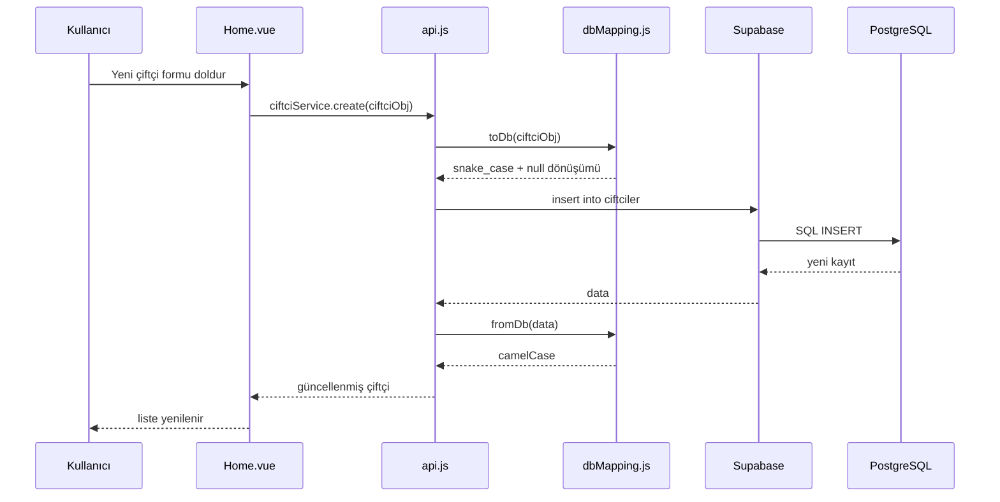

# Hal Yönetim Sistemi — Bitirme Projesi Rapor Bağlam Dosyası

> **Bu dosyanın amacı:** Yapay zekaya veya rapor yazım aracına verilecek kapsamlı proje bağlamıdır. Bitirme projesi raporu (giriş, literatür, analiz, tasarım, uygulama, test, sonuç) hazırlanırken bu dosya tek kaynak (single source of truth) olarak kullanılmalıdır.
>
> **Proje adı:** Hal Yönetim Sistemi (Web Tabanlı Sebze-Meyve Hali Yönetim Uygulaması)  
> **Proje türü:** Bitirme / mezuniyet projesi  
> **Geliştirme dili:** Türkçe arayüz, Türkçe yorum satırları, Türkçe hata mesajları  
> **Proje konumu:** `Hal Projesi/` klasörü  
> **Çalıştırma:** `npm run dev` → http://localhost:3000

---

## 1. Yönetici Özet (Executive Summary)

Hal Yönetim Sistemi, sebze ve meyve hallerinde faaliyet gösteren **halci** (toptancı / hal esnafı) kullanıcılarının çiftçilerini, ürün stoklarını, satışlarını ve halci-halci arası ürün alım taleplerini dijital ortamda yönetmesini sağlayan **tek sayfa uygulama (SPA)** tabanlı bir web sistemidir.

Sistem; **Vue 3**, **Vuetify 3**, **Vue Router**, **Pinia** ve **Supabase (PostgreSQL)** teknolojileri ile geliştirilmiştir. Başlangıçta yerel **JSON Server** ile prototiplenmiş, ardından üretime yakın bir mimari için **bulut veritabanı (Supabase)** mimarisine taşınmıştır.

Temel katkılar:
- Çiftçi ve ürün yaşam döngüsünün uçtan uca dijital takibi
- Halci bazlı stok konsolidasyonu ve satış kaydı
- Halci-halci B2B ürün satın alma talep/onay mekanizması
- HTML tabanlı fatura/fiş üretimi ve indirme
- Responsive, Material Design arayüz

---

## 2. Problemin Tanımı ve Motivasyon

### 2.1 Mevcut Durum (Sorun)
Geleneksel hal işletmelerinde:
- Çiftçi ve ürün bilgileri defter, Excel veya dağınık notlarla tutulur
- Stok durumu anlık görülemeyebilir; aynı ürün farklı çiftçilerden geldiğinde toplam miktar hesaplanması zordur
- Halci-halci ticaretinde sözlü anlaşmalar, takip edilemeyen talepler oluşur
- Satış sonrası fatura/fiş düzenleme manuel ve zaman alıcıdır
- Veri kaybı, mükerrer kayıt ve hatalı fiyatlandırma riski yüksektir

### 2.2 Hedef
Bu proje ile halci kullanıcılarına:
1. Merkezi çiftçi profili yönetimi
2. Ürün bazlı stok takibi (miktar, kalite, son kullanım tarihi)
3. Satış kaydı ve geçmiş satış arşivi
4. Diğer halcilerden ürün satın alma talebi gönderme/alma
5. Bildirim merkezi üzerinden talep onay/red
6. Fatura indirme

sunulması hedeflenmiştir.

### 2.3 Hedef Kullanıcı
- **Birincil:** Halci / hal esnafı (kayıt, giriş, tüm işlemler)
- **Dolaylı:** Halci'nin kayıtlı çiftçileri (sistemde veri olarak tutulur; ayrı giriş yapmazlar)

---

## 3. Proje Kapsamı

### 3.1 Kapsam İçi (In Scope)
| Modül | Açıklama |
|-------|----------|
| Kimlik doğrulama | Halci kayıt, giriş, çıkış, oturum hatırlama |
| Çiftçi yönetimi | CRUD, halci'ye özel listeleme |
| Ürün yönetimi | CRUD, sebze/meyve tipi, kalite sınıfı, durum |
| Stok görünümü | Ürün adı + kalite bazında konsolide stok |
| Satış | Stoktan satış kaydı, alıcı firma bilgileri |
| Geçmiş satışlar | Satış listesi, fatura indirme |
| Halci-halci talep | Ürün satın alma talebi, bildirim, onay/red |
| Fiş görüntüleme | Stok kalemi için çiftçi bazlı detay fişi |
| Fatura üretimi | HTML → `.doc` indirme |

### 3.2 Kapsam Dışı (Out of Scope)
- Çiftçi mobil uygulaması / çiftçi girişi
- Ödeme entegrasyonu (POS, banka)
- E-fatura / GİB entegrasyonu
- Lojistik / sevkiyat takibi
- Gerçek zamanlı websocket bildirimleri (polling kullanılıyor)
- Supabase Auth ile enterprise düzey güvenlik (gelecek iş olarak bırakıldı)

---

## 4. Kullanılan Teknolojiler ve Gerekçeleri

| Teknoloji | Sürüm (yaklaşık) | Rol | Seçim gerekçesi |
|-----------|------------------|-----|-----------------|
| **Vue 3** | 3.5.x | UI framework | Composition API, reaktif yapı, öğrenme eğrisi, ekosistem |
| **Vuetify 3** | 3.10.x | UI bileşen kütüphanesi | Material Design, hazır form/tablo/dialog, responsive grid |
| **Vue Router** | 4.5.x | SPA routing | Sayfa yönlendirme, route guard |
| **Pinia** | 2.2.x | State management | Auth store, global oturum yönetimi |
| **Vite** | 7.x | Build tool | Hızlı HMR, modern ES modules |
| **Supabase** | - | BaaS / PostgreSQL | Yönetilen veritabanı, REST API, RLS altyapısı |
| **@supabase/supabase-js** | 2.107.x | DB client | Frontend'den Supabase erişimi |
| **Sass** | embedded | Stil | Vuetify tema özelleştirme |

### 4.1 Eski Mimari (Evrim)
Proje geliştirme sürecinde **JSON Server** (`db.json`, port 3001) ile başlamıştır. Son aşamada:
- Kalıcı veri
- Çok kullanıcılı yapı
- İlişkisel veri bütünlüğü

ihtiyaçları nedeniyle **Supabase PostgreSQL**'e geçilmiştir. `db.json` yalnızca seed (veri aktarım) kaynağı olarak kalmıştır.

---

## 5. Sistem Mimarisi

### 5.1 Genel Mimari (Katmanlı)

```
┌─────────────────────────────────────────────────────────┐
│                    Kullanıcı (Tarayıcı)                  │
└───────────────────────────┬─────────────────────────────┘
                            │
┌───────────────────────────▼─────────────────────────────┐
│  Sunum Katmanı (Presentation)                            │
│  Login.vue | Register.vue | Home.vue | CiftciDetail.vue │
│  App.vue (layout, bildirimler)                         │
└───────────────────────────┬─────────────────────────────┘
                            │
┌───────────────────────────▼─────────────────────────────┐
│  Durum / Yönlendirme                                     │
│  Pinia (auth.js) | Vue Router (navigation guards)        │
└───────────────────────────┬─────────────────────────────┘
                            │
┌───────────────────────────▼─────────────────────────────┐
│  Servis Katmanı (Business / API)                         │
│  services/api.js                                         │
│  utils/dbMapping.js (camelCase ↔ snake_case)            │
└───────────────────────────┬─────────────────────────────┘
                            │
┌───────────────────────────▼─────────────────────────────┐
│  Veri Erişim Katmanı                                     │
│  lib/supabase.js → Supabase Client                       │
└───────────────────────────┬─────────────────────────────┘
                            │
┌───────────────────────────▼─────────────────────────────┐
│  Supabase (PostgreSQL + PostgREST + RLS)                 │
│  Tablolar: halciler, ciftciler, urunler, satislar,       │
│            talepler                                      │
└─────────────────────────────────────────────────────────┘
```

### 5.2 Mimari Prensipler
- **Separation of concerns:** Vue bileşenleri doğrudan Supabase'e bağlanmaz; `api.js` üzerinden gider
- **Generic CRUD factory:** `createCrudService(tableName)` ile tekrar eden kod azaltılmıştır
- **Naming convention bridge:** Frontend camelCase, veritabanı snake_case; `dbMapping.js` dönüşüm yapar
- **Lazy loading:** Router'da sayfa bileşenleri `import()` ile lazy yüklenir

### 5.3 Veri Akış Diyagramı (Örnek: Çiftçi Ekleme)



---

## 6. Veritabanı Tasarımı

### 6.1 ER İlişkileri (Sözel)

```
halciler (1) ──< (N) ciftciler
ciftciler (1) ──< (N) urunler
halciler (1) ──< (N) satislar
ciftciler (1) ──< (N) satislar (nullable)
urunler (1) ──< (N) satislar (nullable)
halciler (1) ──< (N) talepler [alıcı]
halciler (1) ──< (N) talepler [satıcı]
urunler (1) ──< (N) talepler (nullable)
```

### 6.2 Tablo: `halciler` (Sistem Kullanıcıları)
| Sütun | Tip | Açıklama |
|-------|-----|----------|
| id | bigint PK | Otomatik artan |
| ad, soyad | text | Halci adı |
| email | text UNIQUE | Giriş e-postası |
| sifre | text | Düz metin (geliştirme) |
| vergi_numarasi | text UNIQUE | 10 haneli |
| telefon, adres | text | İletişim |
| sirket_adi | text | Firma unvanı |
| kayit_tarihi | date | Kayıt tarihi |
| aktif | boolean | Hesap durumu |

### 6.3 Tablo: `ciftciler`
| Sütun | Tip | Açıklama |
|-------|-----|----------|
| id | bigint PK | |
| halci_id | FK → halciler | Hangi halciye ait |
| ad_soyad | text | Çiftçi adı |
| telefon, tc_kimlik, adres | text | Kimlik/iletişim |
| kayit_tarihi | date | |
| aktif | boolean | |
| notlar | text | Serbest not |

**Özel kayıt:** Talep onayında alıcı halcinin stoğuna ürün eklemek için otomatik **"Stok Yönetimi"** adlı sanal çiftçi oluşturulabilir.

### 6.4 Tablo: `urunler`
| Sütun | Tip | Açıklama |
|-------|-----|----------|
| id | bigint PK | |
| ciftci_id | FK → ciftciler | CASCADE delete |
| urun_adi | text | 100+ ürün listesinden seçim |
| urun_tipi | text | Sebze / Meyve |
| miktar | numeric | Stok miktarı |
| birim | text | kg, adet vb. |
| fiyat | numeric | Birim fiyat (₺) |
| gelis_tarihi | date | Ürün geliş |
| son_kullanim_tarihi | date | SKT (nullable) |
| kalite | text | A/B/C Sınıfı |
| durum | text | Beklemede, Onaylandı, Reddedildi, Tedarik Edildi |
| notlar | text | |

### 6.5 Tablo: `satislar`
Satış geçmişi ve fatura verisi. Hem doğrudan satış hem talep onayı sonrası kayıt tutar.

Önemli sütunlar: `halci_id`, `ciftci_id`, `urun_id`, `urun_adi`, `miktar`, `birim`, `fiyat`, `birim_fiyat`, `toplam_tutar`, `satis_tarihi`, `satis_saati`, `durum`, alıcı firma bilgileri (`sirket_adi`, `sirket_telefon`, `sirket_adres`, `sirket_vergi_no`), halci-halci alanları (`alici_halci_id`, `alici_sirket_adi`, `fiyat_teklifi`, `satici_fiyati`).

### 6.6 Tablo: `talepler`
Halci-halci ürün satın alma talepleri.

Durumlar: `Beklemede`, `Onaylandı`, `Reddedildi`

Alıcı ve satıcı halci bilgileri, ürün detayları, fiyat teklifi, toplam tutar, tarih/saat alanları içerir.

### 6.7 İndeksler
- `idx_ciftciler_halci_id`
- `idx_urunler_ciftci_id`
- `idx_satislar_halci_id`
- `idx_talepler_satici_halci_id`
- `idx_talepler_alici_halci_id`

### 6.8 Row Level Security (RLS)
Tüm tablolarda RLS **aktif**; geliştirme ortamında `using (true)` ile açık politika uygulanır. Üretimde Supabase Auth + kullanıcı bazlı kısıtlama önerilir.

### 6.9 SQL Dosyaları
| Dosya | Amaç |
|-------|------|
| `supabase/schema.sql` | İlk kurulum (tablolar, indeksler, RLS) |
| `supabase/patch-satis.sql` | Satış tablosu ek sütunları |
| `supabase/patch-talepler.sql` | Talep tablosu alıcı şirket sütunları |
| `supabase/patch-reset-sequences.sql` | Seed sonrası ID sequence düzeltme |
| `supabase/patch-all.sql` | Tüm patch'ler bir arada |

---

## 7. Uygulama Modülleri ve Dosya Yapısı

```
Hal Projesi/
├── src/
│   ├── App.vue                 # Ana layout, app bar, bildirim menüsü, talep onay/red
│   ├── main.js                 # Vue bootstrap, Pinia, Router, auth init
│   ├── lib/
│   │   └── supabase.js         # Supabase client, env kontrolü
│   ├── services/
│   │   └── api.js              # CRUD servisleri (5 tablo + özel sorgular)
│   ├── stores/
│   │   └── auth.js             # Login, register, logout, initAuth
│   ├── utils/
│   │   └── dbMapping.js        # camelCase ↔ snake_case, "" → null
│   ├── router/
│   │   └── index.js            # Rotalar + navigation guard
│   ├── views/
│   │   ├── Login.vue           # Halci giriş
│   │   ├── Register.vue        # Halci kayıt (validasyonlu form)
│   │   ├── Home.vue            # Ana panel (~2000 satır, ana iş mantığı)
│   │   └── CiftciDetail.vue    # Çiftçi profili + ürün CRUD (~1500 satır)
│   └── plugins/
│       ├── index.js
│       └── vuetify.js          # Vuetify tema/konfigürasyon
├── supabase/                   # SQL şema ve patch dosyaları
├── scripts/
│   ├── seed-supabase.mjs       # db.json → Supabase aktarım
│   ├── check-supabase.mjs      # Bağlantı ve kayıt sayısı kontrolü
│   ├── apply-patch.mjs         # Patch uygulama yardımcısı
│   └── apply-reset-sequences.mjs
├── db.json                     # Eski yerel veri / seed kaynağı
├── .env.example                # Ortam değişkeni şablonu
├── vite.config.mjs             # Port 3000, @ alias
└── package.json
```

---

## 8. Sayfa ve Bileşen Detayları

### 8.1 Login.vue
- Email + şifre formu
- Vuetify validasyon kuralları
- Başarılı girişte `/` yönlendirme
- Hata mesajları Türkçe

### 8.2 Register.vue
- Halci kayıt formu: ad, soyad, email, vergi no, telefon, şirket adı, adres, şifre
- **Validasyonlar:**
  - Vergi numarası: yalnızca rakam, 10 hane
  - Telefon: yalnızca rakam, max 11 hane
  - TC kimlik (çiftçi formlarında): yalnızca rakam
  - Email format, şifre min 6 karakter, şifre tekrar eşleşmesi
- Email ve vergi numarası mükerrerlik kontrolü
- Kayıt sonrası otomatik giriş

### 8.3 Home.vue (Ana Panel)
Ana işlevler ve toolbar butonları:

| Buton | İşlev |
|-------|-------|
| Yeni Çiftçi Ekle | Dialog ile çiftçi CRUD |
| Stok | Konsolide stok listesi, fiş görüntüleme, satış başlatma |
| Ürün Satın Al | Halci-halci talep akışı |
| Geçmiş Satışlar | Satış tablosu + fatura indir |
| Çıkış Yap | Oturum kapat |

**Stok hesaplama:** Halci'ye ait tüm çiftçilerin ürünleri çekilir; aynı `urunAdi + kalite + birim` kombinasyonunda miktarlar toplanır.

**Satış (satisYap):** Seçilen stok kalemi için alıcı firma bilgileri alınır, `satislar` tablosuna kayıt oluşturulur. Stok görünümü satış kayıtlarıyla birlikte yeniden hesaplanır.

**Ürün Satın Al akışı:**
1. Ürün adı + kalite seç
2. Bu ürünü stoğu olan diğer halcileri listele (kendi halci hariç)
3. Satıcı halci seç → miktar + fiyat teklifi gir
4. `talepler` tablosuna `Beklemede` kayıt oluştur

**Fatura indirme (faturayiIndir):**
- Geçmiş satış kaydından HTML fatura üretilir
- `birimFiyat` / `toplamTutar` / `fiyat` alanları desteklenir
- Tek sayfa kompakt A4 düzeni
- `.doc` olarak indirilir (Word uyumlu HTML)
- Satış tarihi doğru gösterilir

**Fiş (fisDialogunuAc):** Stok kaleminin hangi çiftçilerden ne kadar geldiğini gösterir (canlı ürün verisinden; tarihsel snapshot değil).

### 8.4 CiftciDetail.vue
- Route: `/ciftci/:id`
- Çiftçi profil kartı (telefon, TC, adres, kayıt tarihi, notlar)
- Ürün listesi kart görünümü
- Ürün ekleme/düzenleme dialogu:
  - 100+ sebze/meyve autocomplete listesi
  - Ürün tipi, miktar, birim, fiyat, kalite, geliş/SKT, durum, notlar
- Çiftçi düzenleme ve silme (cascade: ürünler de silinir)
- İstatistik: toplam ürün sayısı

### 8.5 App.vue
- Global app bar (Login/Register hariç)
- Kullanıcı profil menüsü
- **Bildirim sistemi:**
  - Satıcı halciye gelen `Beklemede` talepler
  - Badge ile sayı gösterimi
  - 30 saniyede bir otomatik yenileme (polling)
  - Talep detay expand/collapse
  - Onayla / Reddet butonları

**Talep onay iş mantığı (kritik):**
1. Ürün stok yeterliliği kontrol
2. Kabul edilen fiyat = `fiyatTeklifi` veya `birimFiyat`
3. `satislar` tablosuna satış kaydı
4. Satıcı ürün miktarından düş (`urunler.update`)
5. Miktar 0 → durum `Tedarik Edildi`
6. Alıcı halcinin **"Stok Yönetimi"** çiftçisine yeni ürün ekle
7. Talep durumu → `Onaylandı`

---

## 9. Kimlik Doğrulama ve Oturum Yönetimi

### 9.1 Mevcut Uygulama
- `auth.js` Pinia store
- Login: tüm halciler çekilir, email+şifre+aktif eşleşmesi client-side
- Token: `token_{halciId}_{timestamp}` (sahte JWT değil)
- `localStorage`: `hal_token`, `hal_halci`
- `initAuth()`: sayfa yenilemede oturum geri yükleme
- Router guard: `requiresAuth`, `requiresGuest`

### 9.2 Güvenlik Notları (Rapor için dürüst analiz)
| Konu | Mevcut | Önerilen |
|------|--------|----------|
| Şifre saklama | Düz metin | bcrypt / Supabase Auth |
| Oturum | localStorage token | HttpOnly cookie / JWT |
| Yetkilendirme | RLS açık | Kullanıcı bazlı RLS |
| API anahtarı | VITE_ anon key (public) | RLS ile koruma zorunlu |

---

## 10. İş Kuralları ve Algoritmalar

### 10.1 Ürün Durumları
- `Beklemede` — Varsayılan yeni ürün
- `Onaylandı` — Satın alınan / onaylanmış ürün
- `Reddedildi` — Reddedilmiş
- `Tedarik Edildi` — Stok tükenmiş

### 10.2 Talep Durumları
- `Beklemede` → `Onaylandı` veya `Reddedildi`

### 10.3 Veri Dönüşüm Kuralı (`toDb`)
- Vue camelCase → DB snake_case
- Boş string `""` → PostgreSQL `null` (date alanlarında hata önleme)

### 10.4 Stok Yönetimi Çiftçisi
Halci-halci alımda alıcı tarafında otomatik oluşturulan sistem çiftçisi:
- `adSoyad`: "Stok Yönetimi"
- Satın alınan ürünler bu çiftçi altına eklenir
- Böylece alıcı halci stok ekranında ürünleri görür

### 10.5 Ürün Listesi
100+ sebze ve meyve çeşidi sabit dizi olarak tanımlı (autocomplete). Örnekler: Domates, Salatalık, Muz, Elma, Portakal, Avokado, vb.

---

## 11. Ortam Değişkenleri ve Kurulum

```env
VITE_SUPABASE_URL=https://xxxx.supabase.co
VITE_SUPABASE_ANON_KEY=eyJ...
SUPABASE_SERVICE_ROLE_KEY=eyJ...   # Sadece seed script için
```

**Kurulum adımları:**
1. `npm install`
2. Supabase projesi oluştur
3. `supabase/schema.sql` çalıştır
4. Gerekirse patch dosyalarını uygula
5. `.env` oluştur
6. (Opsiyonel) `npm run seed`
7. `npm run dev`

**Test hesabı (seed verisi):**
- Email: `halci@example.com`
- Şifre: `halci123`

---

## 12. Test ve Doğrulama

### 12.1 Otomatik Kontroller
| Script | Amaç |
|--------|------|
| `scripts/check-supabase.mjs` | Bağlantı + tablo kayıt sayıları |
| `scripts/test-ciftci-create.mjs` | Çiftçi ekleme testi |
| `npm run build` | Production build doğrulama |

### 12.2 Manuel Test Senaryoları
1. Halci kayıt → giriş → çıkış
2. Çiftçi ekle → düzenle → sil
3. Ürün ekle (boş SKT ile) → düzenle → sil
4. Stok ekranında konsolide miktar doğrula
5. Satış yap → geçmiş satışlarda gör → fatura indir
6. Halci A'dan Halci B'ye talep gönder
7. Halci B bildirimden onayla → stok düşüşü + alıcı stoğa ekleme
8. Talep reddet
9. Sayfa yenile → oturum devam
10. Form validasyonları (harfli TC, telefon, vergi no)

### 12.3 Bilinen Sınırlamalar
- Fiş/fatura dosyaları veritabanında saklanmaz; anlık HTML üretilir
- Satış kaydı sonrası bazı senaryolarda ürün miktarı otomatik düşmeyebilir (doğrudan satış vs talep onayı farklı akışlar)
- Bildirimler polling ile; gerçek zamanlı değil
- Bundle boyutu ~508 KB (Vuetify + fontlar)
- Git versiyon kontrolü projede opsiyonel

---

## 13. Karşılaşılan Sorunlar ve Çözümler (Proje Günlüğü)

| Sorun | Kök neden | Çözüm |
|-------|-----------|-------|
| Yeni çiftçi eklenemiyor | Seed sonrası PostgreSQL sequence uyumsuz | `patch-reset-sequences.sql` |
| Yeni ürün eklenemiyor | Boş `sonKullanimTarihi` (`""`) date hatası | `toDb()` boş string → null |
| Talep gönderilemiyor | `talepler` tablosunda alıcı sütunları eksik | `patch-talepler.sql` |
| Talep onaylanamıyor | `satislar` tablosunda halci-halci sütunları eksik | `patch-satis.sql` |
| Faturada toplam yok | `birimFiyat`/`toplamTutar` vs `fiyat` uyumsuzluğu | `faturayiIndir` güncellendi |
| Fatura 2 sayfa | Uzun HTML şablon | Kompakt tek sayfa CSS |
| TC/telefon/vergi harf kabul | Input validasyon eksik | Sadece rakam kuralı eklendi |
| schema.sql tekrar çalışınca hata | Policy already exists | `drop policy if exists` |

---

## 14. Gelecek Geliştirmeler (Future Work)

1. Supabase Auth entegrasyonu
2. Şifre hash (bcrypt / argon2)
3. RLS politikalarının sıkılaştırılması
4. WebSocket / Supabase Realtime ile anlık bildirim
5. E-fatura entegrasyonu
6. Çiftçi mobil arayüzü veya SMS bildirimi
7. Dashboard grafikleri (satış trendi, stok uyarıları)
8. SKT yaklaşan ürünler için otomatik uyarı
9. Çoklu dil desteği
10. Unit / E2E test altyapısı (Vitest, Cypress)
11. Code splitting ile bundle optimizasyonu
12. Kullanılmayan bağımlılıkların temizlenmesi (axios, json-server)

---

## 15. Rapor Yazım Talimatları (AI İçin)

Aşağıdaki talimatlar, bu dosyayı okuyan yapay zekanın **bitirme projesi raporu** üretmesi içindir.

### 15.1 Rapor Dili ve Ton
- **Dil:** Türkçe, akademik ama anlaşılır
- **Kişi:** "Bu çalışmada...", "Geliştirilen sistem..." (3. tekil veya edilgen)
- **Uzunluk hedefi:** 40–80 sayfa (bölüm derinliğine göre)
- **Format:** Word/PDF uyumlu; başlık hiyerarşisi (1, 1.1, 1.1.1)

### 15.2 Önerilen Rapor İçeriği

1. **Kapak, Onay, Özet, Abstract, İçindekiler**
2. **Giriş**
   - Problem tanımı (Bölüm 2)
   - Projenin amacı ve kapsamı (Bölüm 3)
   - Raporun organizasyonu
3. **Literatür / Mevcut Sistemler**
   - Tarım tedarik zinciri yazılımları
   - Hal / market yönetim sistemleri
   - Web teknolojileri (SPA, BaaS) eğilimleri
4. **Analiz ve Gereksinimler**
   - Fonksiyonel gereksinimler (modül tablosu)
   - Fonksiyonel olmayan: performans, kullanılabilirlik, güvenlik
   - Kullanıcı hikayeleri / use case diyagramları
5. **Sistem Tasarımı**
   - Mimari (Bölüm 5 diyagramları)
   - Veritabanı ER diyagramı (Bölüm 6)
   - Arayüz tasarım kararları (Vuetify, responsive)
6. **Uygulama**
   - Teknoloji seçim gerekçeleri (Bölüm 4)
   - Modül modül uygulama anlatımı (Bölüm 8)
   - Önemli kod akışları (auth, talep onay, fatura)
   - JSON Server → Supabase migrasyon süreci
7. **Test ve Sonuçlar**
   - Test senaryoları (Bölüm 12)
   - Ekran görüntüsü yer tutucuları `[Şekil X: ...]` ekle
   - Başarı kriterleri değerlendirmesi
8. **Güvenlik Değerlendirmesi**
   - Mevcut durum + iyileştirme önerileri (Bölüm 9)
9. **Sonuç ve Öneriler**
   - Hedeflere ulaşma durumu
   - Gelecek çalışmalar (Bölüm 14)
10. **Kaynakça**
11. **Ekler**
    - Kurulum kılavuzu
    - Veritabanı şema çıktısı
    - Örnek ekran görüntüleri listesi

### 15.3 Üretirken Dikkat Edilecekler
- Gerçek olmayan özellik uydurma; bu dosyada **Out of Scope** olanları tamamlanmış gibi yazma
- Güvenlik zafiyetlerini gizleme; akademik dürüstlükle "geliştirme aşamasında" de
- Teknoloji sürümlerini yaklaşık belirt (package.json referans)
- Hal domain terminolojisini doğru kullan: halci, çiftçi, stok, talep, fatura, fiş
- En az 3 sequence/akış diyagramı öner: giriş, talep onay, satış+fatura

### 15.4 Örnek Use Case (Rapor için)

**UC-01: Halci-halci ürün satın alma**
- **Aktörler:** Alıcı Halci (A), Satıcı Halci (B)
- **Ön koşul:** Her iki halci de giriş yapmış; B'nin stoğunda ürün var
- **Ana akış:**
  1. A "Ürün Satın Al" → ürün + kalite seçer
  2. Sistem B'yi listeler
  3. A miktar ve fiyat teklifi girer, talep gönderir
  4. B bildirimde talebi görür
  5. B onaylar
  6. Sistem satış kaydı oluşturur, B stoğundan düşer, A stoğuna ekler
- **Sonuç:** Talep `Onaylandı`, her iki tarafta stok güncel

### 15.5 Değerlendirme Kriterleri (Rapor sonuç bölümü için)
- Fonksiyonel gereksinimlerin karşılanma oranı: yüksek
- Kullanılabilirlik: Vuetify ile iyi
- Ölçeklenebilirlik: Supabase ile orta-iyi
- Güvenlik: geliştirme seviyesi, iyileştirme gerekli
- Bakım kolaylığı: katmanlı mimari ile iyi

---

## 16. İstatistikler ve Proje Metrikleri

| Metrik | Değer |
|--------|-------|
| Ana Vue sayfaları | 4 (Login, Register, Home, CiftciDetail) |
| Veritabanı tabloları | 5 |
| API servis modülleri | 5 (halci, ciftci, urun, satis, talep) |
| Seed örnek veri (yaklaşık) | 8 halci, 21 çiftçi, 30 ürün, 3 satış, 2 talep |
| Ürün çeşidi listesi | 100+ |
| Dev port | 3000 |
| Build çıktısı | `dist/` klasörü |

---

## 17. Sözlük (Glossary)

| Terim | Açıklama |
|-------|----------|
| Halci | Halde faaliyet gösteren toptancı / işletme sahibi (sistem kullanıcısı) |
| Çiftçi | Halci'ye ürün getiren üretici/tedarikçi (veri kaydı) |
| Stok | Halci'ye bağlı tüm çiftçilerin ürün miktarlarının konsolide görünümü |
| Talep | Bir halcinin diğer halciden ürün satın alma isteği |
| Fiş | Stok kaleminin çiftçi bazlı dağılım raporu |
| Fatura | Satış sonrası alıcı firmaya düzenlenen belge (HTML/doc) |
| RLS | Row Level Security — satır düzeyinde veritabanı erişim kontrolü |
| SPA | Single Page Application — tek sayfa uygulama |

---

## 18. Referans Komutlar

```bash
npm install          # Bağımlılıkları yükle
npm run dev          # Geliştirme sunucusu (localhost:3000)
npm run build        # Production build
npm run preview      # Build önizleme
npm run seed         # db.json → Supabase veri aktarımı
node scripts/check-supabase.mjs   # DB sağlık kontrolü
```

---

*Son güncelleme: Proje Supabase entegrasyonu tamamlandıktan sonra hazırlanmıştır. Rapor yazımında bu dosya ile birlikte `README.md`, `supabase/schema.sql` ve kaynak kod (`src/`) birlikte referans alınmalıdır.*
